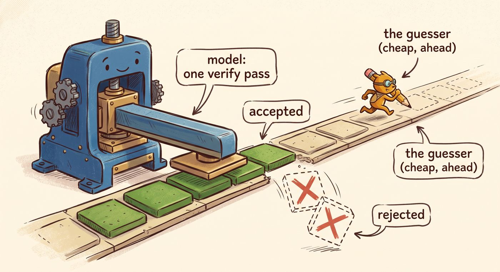
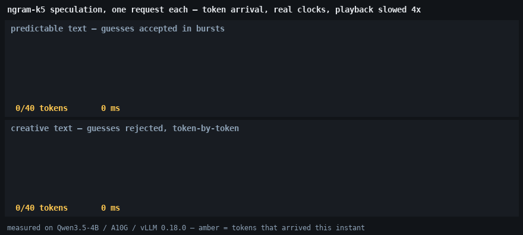
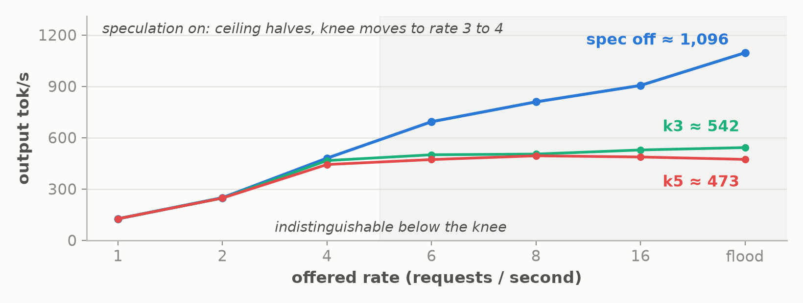
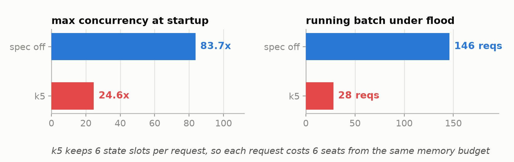

*Part 7 of "The Inference Wall". Same rig as the whole series: Qwen3.5-4B, fp16,
one NVIDIA A10G with 23 GB, measured under real load.*

*Manas Pathak · October 9, 2026*

[The Inference Wall]({{ '/' | relative_url }}) · [All posts]({{ '/articles/' | relative_url }}) · **Part 7**

Speculative decoding is a technique for getting several tokens of one request out of a
single pass over the model's weights: a cheap guesser proposes a run of tokens and the
model verifies them all at once. The two founding papers,
[Leviathan, Kalman and Matias](https://arxiv.org/abs/2211.17192) and
[Chen et al.](https://arxiv.org/abs/2302.01318), report 2-to-2.5x single-stream
speedups, and serving guides generally present it as close to free. This post measures
vLLM's implementation on the series rig across the full load range, from one request on
an idle server to a saturated flood, and the result splits in two. On a quiet server it
does deliver: single-request generation runs up to **1.8x faster**. Under
production-style load the same configuration **cuts total throughput from ~1,100 tokens
a second to ~490** and raises time-to-first-token from 5 seconds to 22. Same model, same
GPU, same configuration; which way it goes is set by how busy the server is, and the
documentation does not say where that line falls.

The rest of the post pins down that line. It explains the inversion through two
measurable mechanisms, then opens a profiler trace showing that speculation does
something more structural than the framing suggests: it replaces the model's decode loop
with a different one.

If you have not read the earlier parts, one fact carries everything below, and it was
measured in [Part 1]({{ '/articles/part-1/' | relative_url }}): generating text is *memory-bound*. To produce each token of the
answer, the GPU must stream the model's entire weights, 8.6 GB for the model used
throughout this series, out of its memory, and that streaming is what a token costs. On
this rig, about 20 ms. Every real speedup in serving is some way of getting more tokens
out of one stream of those bytes. Batching shares one stream across many users'
requests; that was [Part 3]({{ '/articles/part-3/' | relative_url }}). Quantization shrinks the bytes in the stream; that was
[Part 6]({{ '/articles/part-6/' | relative_url }}). Speculative decoding is the third lever: getting several tokens *of the same
request* out of one stream. That frame carries everything below. The rig is one NVIDIA
A10G with 23 GB serving Qwen3.5-4B in fp16, and every number here is measured on it,
warm, under real load.

## How speculative decoding works



Call the model you are serving **L**, for large. Why must L pay one full weight-stream
per token, instead of producing the whole answer in one go? Because each token of the
answer is an *input* to the next one: token 13 cannot be computed until token 12 exists.
A prompt's tokens all exist up front, which is why reading a prompt is fast; an answer's
tokens do not. One token, one pass, one 8.6 GB stream: the 20 ms floor.

But there is an asymmetry hiding in that constraint. *Producing* a token costs L a full
pass, yet *checking* a proposed continuation is nearly free: given k proposed tokens, L
can run **one** forward pass over all of them at once, exactly as if they were a k-token
prompt, and that single pass reveals what L itself would have produced at every one of
the k positions. One weight-stream, k verdicts.

Speculative decoding exploits that asymmetry with a second, cheap guesser, **S**, for
small:

1. **S proposes** the next k tokens. The depth k is the knob you set; this post tests
   five and three, written **k5** and **k3** from here on.
2. **L verifies** all k proposals in one shared pass.
3. Walk the positions in order: while S's token matches what L would have said,
   **accept** it. At the first mismatch, discard that guess and everything after it,
   take L's own token for that position, which the verify pass already computed, and go
   back to step 1.

If all k guesses are right, one weight-stream bought k+1 tokens. If the first guess is
wrong, the pass bought exactly what a normal decode step buys, one token, plus the
wasted work of checking dead proposals. The economics reduce to one
number, the **acceptance rate**: what fraction of S's guesses survive verification.

The 2 to 2.5x the founding papers report, the figure the folklore rounds up from, was
measured one request at a time, with a well-matched drafter, on tasks the drafter could
predict. All three qualifiers matter below.

## What S is in this experiment, and what "ngram" actually means

The classic S is a small language model from the same family, maybe one-tenth of L's
size, loaded onto the same GPU alongside L. vLLM 0.18 supports that, plus trained
guessers like [EAGLE](https://arxiv.org/abs/2401.15077) and
[Medusa](https://arxiv.org/abs/2401.10774) that bolt a small guessing head onto L
itself. All of those *compute* their candidates, which is what makes them useful on
open-ended text, and all of them cost something to run.

This post uses the simplest S available, and the name misleads, so it needs stating
exactly. vLLM's **ngram** method, also known as
[prompt lookup decoding](https://github.com/apoorvumang/prompt-lookup-decoding), is
**not a language model and keeps no table of n-gram statistics**. It never computes or
scores a candidate. Its one operation is a string search over the text this request
already holds, prompt plus output so far: take the last few tokens L just produced, find
the same phrase earlier in that text, and copy whatever followed it.

A worked example, with words standing in for tokens. The prompt is `Repeat this
sentence: The quick brown fox jumps over the lazy dog.` and L has so far produced `The
quick brown`. The text the server holds for this request is:

```
Repeat this sentence : The quick brown fox jumps over the lazy dog . The quick brown
```

S takes the last tokens L emitted, `The quick brown`, as its search key, trying phrase
lengths from four down to two, the `prompt_lookup_max` and `prompt_lookup_min` settings.
It finds the same three words inside the prompt. The five tokens that followed there,
`fox jumps over the lazy`, become the k5 proposal. S did not judge that `fox` is likely.
It copied `fox` because `fox` sat after `The quick brown` the one earlier time that
phrase appeared. L then verifies all five in one pass. Had there been no prompt, so that
the whole text was just `The quick brown`, there would be nothing earlier to search, S
would propose nothing, and the step would run as an ordinary decode.

So the search key is always text L has already committed, the candidates are always a
copy of what once followed it, and L is the only party that ever judges a token. S's
cost is a string search, which pins its share of every measurement below at zero:
**everything measured here is the cost and benefit of L's verification machinery**. A
real draft model would change the guess quality, not the cost structure of checking.

Prompt lookup is not a vLLM quirk. The same guesser ships in HuggingFace `transformers`
as `prompt_lookup_num_tokens`, and in TensorRT-LLM, SGLang, and TGI. Nor is the
inversion below engine-specific: the first mechanism is a property of any server that
batches requests continuously, the second of any hybrid-attention model, whichever
engine serves it. vLLM is the instrument, not the cause.

What this buys in practice follows from the mechanism: ngram helps wherever the output
reuses stretches of text the request already contains. Output that copies from the
input: summarization and retrieval-augmented answers that quote their source, code edits
that re-emit a function with a few lines changed, document rewrites, agent loops that
restate tool arguments and file paths from context. Output that copies from itself: JSON
with repeated keys, tables and lists built on a fixed per-item template, code that reuses
its own names and signatures, boilerplate. Where nothing recurs, open-ended chat,
creative writing, reasoning from scratch, the search finds no match and S contributes
nothing; that is the workload draft models and EAGLE exist for. The two probe prompts
below sit at the poles, perfect copy and no copy, so the mechanism shows cleanly; real
traffic lands in between.

## Single stream on an idle server

Single stream, temperature 0, 160 output tokens, three repetitions, spread under 1%:

| Prompt | Spec off | k5 = guess 5 ahead | k3 = guess 3 ahead |
|---|---|---|---|
| predictable, repeat a sentence | 20.05 ms/token | **11.2 ms/token, 1.79x** | 12.25, 1.64x |
| creative, a surreal poem | 20.05 ms/token | 19.4, no change | 21.9, **0.92x, a real penalty** |

The baseline column is Part 1's floor re-measured: 20.05 ms per token, dead flat,
because a plain decode step costs one weight-stream no matter what the token says.
Speculation breaks the flatness in both directions: 1.8x on text the lookup can predict,
nothing on text it cannot, and at k3 a real 8% penalty, the proposal-and-verify
machinery paid for and never once useful.

The per-token arrival pattern makes the difference concrete. The
animation below replays both prompts against the k5 server using the measured arrival
process: bursts of about three tokens every 36 ms in the top pane, a steady one token
per 19 ms in the bottom. Playback is slowed 4x; the clocks are real.



A note on the 1.8x, since the papers say 2 to 2.5x and an earlier small-model study of
mine clocked this same ngram method at 3.7x on a purely repetitive prompt. The
repeat-a-sentence prompt accepts nearly everything early in the answer, but this model
drifts into free-form reasoning text partway through, which a lookup cannot predict, and
over the full run the **mean accepted length is about 2** per verify step out of a
possible 6. A probe that catches only the early window reports 4x and is wrong as a
steady-state number; 1.8x is what a real 160-token generation got.

## The same configuration under load

Now the series' standard measurement: a fixed workload of 256 input and 128 output
tokens, randomly generated, the request rate swept from 1 per second to a flood, 200
prompts per point, warm server. Random tokens are the acceptance-hostile extreme, and
the server metrics confirm it: in the k5 arm, the guess-5 configuration, **about 21% of
drafted tokens are accepted**. Output tokens per second:

| Offered rate | Spec off | k5 | k3 |
|---|---|---|---|
| 1 | 126 | 126 | 126 |
| 2 | 249 | 247 | 247 |
| 4 | 480 | 443 | 466 |
| 6 | 693 | 472 | 500 |
| 8 | 809 | 494 | 504 |
| 16 | 905 | 487 | 528 |
| flood | **1,096** | **473** | **542** |



Below the knee, nothing: at rates 1 and 2 the three servers are indistinguishable,
because the GPU has idle headroom and wasted verification vanishes into it. From rate 4
the speculation arms fall behind, and past the knee they collapse. Under flood, k5
sustains **473 tokens a second against the baseline's 1,096**, less than half. Re-run
for stability, the k5 flood point landed at 491 and 493 against a baseline of 1,097 both
times, a 2.2x gap. Median time-to-first-token under flood: 22 seconds versus 5. The knee
itself moves from rate 6-to-8 down to between 3 and 4, so the flag did not just lower
the ceiling, it halved the healthy operating range. The k3 arm shows the dose-response:
guess less, waste less, 542 versus 473 at flood, but still lose half the server.

One more probe separates the two variables at play, load and workload. Hold the load
fixed at 32 simultaneous requests and change only the text:

| 32 concurrent requests | Spec off | k5 | k3 |
|---|---|---|---|
| predictable text | 1,035 tok/s | 1,183, up 14% | 1,293, up 25% |
| creative text | 1,071 tok/s | **577, down 46%** | 811, down 24% |

Read the off column first: a plain server does not care what it writes, 1,035 against
1,071. The speculation columns swing by 2x between the same two rows. Same server, same
concurrency, same flag; the only difference is whether the guesses land. **Under load,
acceptance rate decides the sign.**

## Why it inverts, mechanism 1: speculation multiplies the work batching cannot share

To follow this you need one fact from Part 3, restated plainly. A decode step's work has
two parts:

- **Shared:** streaming the 8.6 GB of weights. One stream serves the whole batch,
  whether 1 request or 146 are riding it. This is the part batching amortizes.
- **Private:** each request must also process the new token *against its own
  conversation memory*, the cached history that belongs to that request alone. Your
  request's history is different data from mine, so this work cannot be shared or
  amortized; the step pays it once per request, every step.

Part 3 measured the consequence: as the batch grows, the shared stream is split ever
thinner while the private work accumulates per request, and at a batch of about 61 the
private work becomes what fills the step. A loaded server lives past that point. Its
steps are already full of private work.

Now watch what speculation does to each part. The shared stream it leaves alone; that is
the point of the technique: same stream, more verdicts. The **private work it multiplies by k+1**:
at k5, verifying a request means processing six positions against that request's private
history instead of one. On an idle server the multiplied private work hides in the
stream's shadow, which is why rates 1 and 2 showed no cost. On a loaded server the
private work *is* the step, there is no shadow, and multiplying it by six while only 21%
of positions survive verification means most of every step is spent computing verdicts
for tokens that get thrown away. Each wasted position displaces a real one.
**Speculation and batching compete for the same headroom, and under load batching has
already spent it.**

## Why it inverts, mechanism 2: state checkpoints cut concurrency

The second mechanism shows up in the startup log, before any request is served. To
discard a wrong guess, the server must be able to *rewind* the model's internal state to
before the guess. For most of a transformer that is trivial: the model's memory of the
conversation is a per-token cache, the KV cache, and rewinding three tokens means
truncating three entries. But Qwen3.5 is a *hybrid-attention* model. Only 8 of its 32
layers keep that per-token cache; the other 24 keep a **fixed-size recurrent state**
instead, a single running summary that is overwritten as each token is processed. A
running summary has no entries to truncate. Once updated, the old state is gone. vLLM's
solution is checkpointing: with k5 armed, it budgets **six state slots per request**,
one per speculated position plus the base, so any prefix can be restored.

Those slots come out of the same fixed memory budget that determines how many requests
the server can hold at once. Speculation just multiplied each request's share of it by
six, and the effect shows up at startup, before a single request is served:

| | Spec off | k5 |
|---|---|---|
| Max concurrency, from vLLM's startup log | **83.71x** | **24.64x** |
| `Running:` under flood, from the scheduler log | **146 reqs** | **28 reqs** |



The speculating server admits 28 concurrent requests where the plain server ran 146, and
parks the rest in a waiting queue. Readers of Part 5 will recognize the signature: when
this scheduler cannot fit another request's memory, it does not crash or evict, it
quietly stops admitting, and the tell is a `Running:` count pinned far below the
configured cap while `Waiting:` piles up. In Part 5 it took a deliberate 15x cache cut
to force that behavior. Here an optimization flag did it. And the price is set by the
batching arithmetic above, before a single wasted draft is counted: 28 requests sharing
each weight-stream cannot approach the throughput of 146 sharing it. The two mechanisms
compound, wasted verdicts inside each step and fewer requests allowed into the step, and
together they are how a "speedup" halves your throughput.

## The trace: a verify loop in place of the decode loop

The numbers are above; here is the trace that shows the steps producing them. The
capture: eight long-lived predictable-text decoders against the k5 server, profiler
window with no arrivals, 35,202 GPU kernels over two seconds.

The most surprising line in the analysis: the decode kernel this series has leaned on
since Part 1, the one-token-per-pass linear-attention recurrence named
`fused_recurrent_gated_delta_rule`, appears in this trace **zero times**. Every step
instead runs the *multi-token* variant of the same layer,
`fused_sigmoid_gating_delta_rule_update`: 1,320 calls, which at 24 linear-attention
layers per pass is exactly 55 engine steps. Turning on speculation does not bolt some
machinery onto the decode loop; it swaps the loop out for a verify loop, a different
kernel doing prompt-reading-shaped work at generation time. Reading a prompt is "one
stream, many tokens"; speculation runs generation through that same shape of work.

The step timing puts the entire trade in two numbers. A verify step takes **36 ms**
where an ordinary decode step at this batch size takes about 20 ms, but it processes six
positions per sequence instead of one: **6 ms per position, versus 20**. There, in one
measurement, is the gain the technique offers. The risk sits in the same number: at the flood
workload's 21% acceptance, that same 36 ms step keeps only about two tokens, roughly
18 ms per *accepted* token, the baseline's price paid through a costlier machine, before
the collapsed batch is even counted.

One more reading: during verify-heavy decode the GPU is only **80% busy**,
against 97 to 99.7% in Part 1's pure decode loop. The proposer and the accept-reject
bookkeeping between steps leave real gaps. Speculation trades a fully-packed slow loop
for a gappier fast one, and the gaps are part of the price.

## Does it make the answers worse?

No, by construction. The accept-reject rule is designed so the final output provably
comes from the same distribution L alone would produce; the proof is in the
[Leviathan et al.](https://arxiv.org/abs/2211.17192) paper. At temperature 0 it needs no
math: a guess is accepted only if it is exactly the token L would have picked, so every
token in the answer is one L chose. S never overrules L. It pre-computes what L was going
to say, and wrong guesses are discarded before anyone sees them.

Two qualifications. First, same distribution does not mean same text. Within each
configuration our temperature-0 runs were byte-identical across three repetitions;
across configurations they diverged, spec-on and spec-off writing different
continuations of the same prompt, k3 a different poem than k5. Verification changes the
GPU kernel shapes, kernel shapes perturb logits in their last decimal places, and at a
near-tie a flipped choice cascades into a different continuation, the same
nondeterminism batch size already causes. Neither continuation is worse, but tests that
assert exact strings will fail. Second, the guarantee belongs to the *strict* acceptance
rule. Variants that relax it to accept more guesses, Medusa's "typical acceptance" for
one, genuinely change the output distribution; know which rule your engine runs.

If quality matters enough to verify rather than trust, diffing strings is ruled out by
the above. Run the eval suite you already trust against the server with speculation off
and then on, and compare scores within noise. This study measured speed and leaned on
the strict-acceptance design for the quality claim.

## What to take away

1. **Speculative decoding spends idle capacity to buy latency.** Where there is slack, a
   single stream on a quiet GPU, it converts unused verify headroom into a real speedup,
   1.8x here on predictable text. Where there is no slack, the spending continues and the
   buying stops.
2. **Under load it can invert, hard.** On this rig and a low-acceptance workload it cut
   saturated throughput from 1,096 to 473 tokens a second and moved the knee from rate
   6-to-8 down to 3-to-4, by multiplying exactly the per-request work batching cannot
   amortize.
3. **On hybrid models it also cuts concurrency.** Rewinding recurrent state means k+1
   checkpoints per request: max concurrency fell from 83.7x to 24.6x and the flooded
   running batch from 146 to 28. Check your engine's startup concurrency line before and
   after enabling it.
4. **The decision is a workload measurement, not a belief.** At the same 32-request
   concurrency, k5 gained 14% on predictable text and lost 46% on novel text. The
   server's acceptance metrics tell you where your traffic sits; read them before and
   after enabling it, and again when traffic changes.
5. **Quality is preserved by design; reproducibility is not.** Strict acceptance keeps
   the output distribution; exact temperature-0 strings will still change, as they do
   with batch size.

Part 1's claim gets one more face: inference on this hardware is a bytes-through-memory
problem, and every lever this series has measured, batching, quantization, speculation,
is a different way of getting more tokens out of the same stream of bytes. The first two
spend little and stack cleanly. This one pays only when a guess is accepted, your
traffic sets how often that happens, and the cost of a miss grows with load.

---

*Reproduce: the A/B driver `run_spec_study.sh`, the probe and follow-up scripts, the
verify-step trace `spec_verify_trace.json.gz` openable in `chrome://tracing`, the trace
analyzers `tp_spec_kernels.py` and `tp_spec_steps.py`, and the animation renderer
`render_spec_animation.py` are in the companion repo under
[`experiments/07-speculative-decoding/`](https://github.com/mapathak-commits/inference-wall/tree/main/experiments/07-speculative-decoding);
all raw logs, `spec_study.log`, `spec_followup.log`, and the per-arm `server_*.log` files
carrying the acceptance metrics and `Running:` lines, plus the trace, are in
[`benchmarks/07-speculative-decoding/`](https://github.com/mapathak-commits/inference-wall/tree/main/benchmarks/07-speculative-decoding)
and back every number here. Single A10G, vLLM 0.18.0; the absolute numbers are
rig-specific.*

*Further reading: the two founding papers,
[Leviathan et al., "Fast Inference from Transformers via Speculative Decoding"](https://arxiv.org/abs/2211.17192)
and [Chen et al., "Accelerating Large Language Model Decoding with Speculative Sampling"](https://arxiv.org/abs/2302.01318);
[prompt lookup decoding](https://github.com/apoorvumang/prompt-lookup-decoding), the
model-free guesser used here; [EAGLE](https://arxiv.org/abs/2401.15077) and
[Medusa](https://arxiv.org/abs/2401.10774), trained-guesser variants; and
[vLLM's speculative-decoding docs](https://docs.vllm.ai/en/latest/features/spec_decode.html)
for the configuration surface.*

---

**Previous:** [Part 6: Quantization to make a model fit]({{ '/articles/part-6/' | relative_url }}) · **Next:** Part 8, coming next Friday · [All posts]({{ '/articles/' | relative_url }})

---

*Disclaimer: This blog is written and published in my personal capacity. The opinions,
findings, and conclusions expressed herein are solely my own and do not necessarily
represent the views, policies, or endorsements of my current or past employers.*
