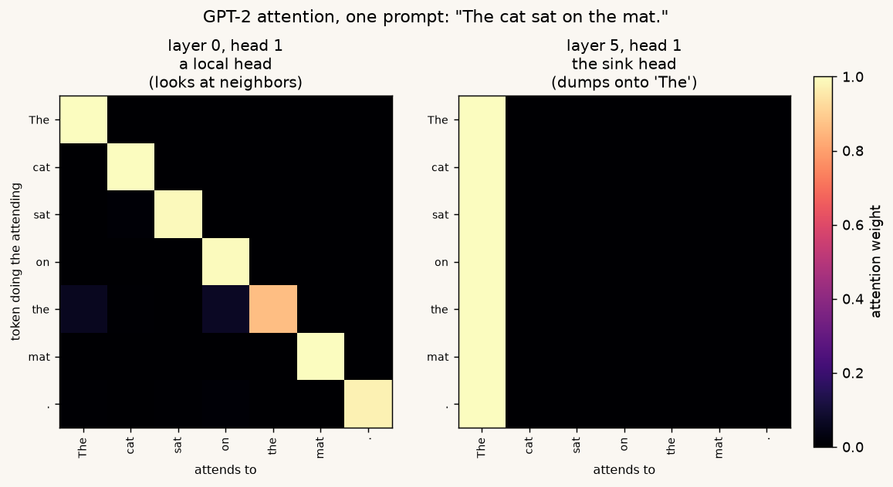
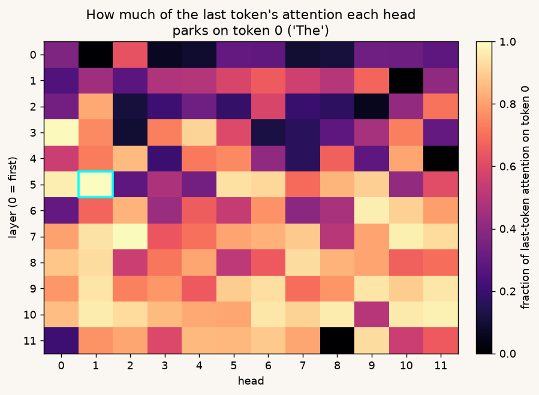
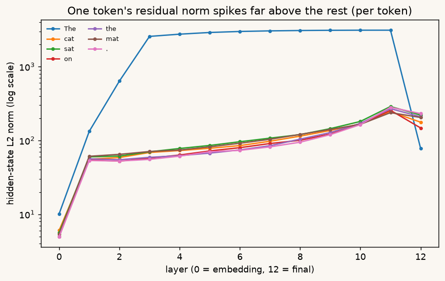

# Field note: I opened up one prompt to see what the model was thinking. It was thinking about the word "The."

*Field notes are the short lane of The Inference Wall: one prompt, one measurement, one thing I didn't expect. No production stack, no benchmark suite. Just a look inside.*

---

Most of this series watches models from the outside. Tokens per second, batch sizes, KV-cache blocks, the shape of a decode step in a trace. That's the serving layer, and it's where the money is.

Underneath it sits a layer the serving stack never shows you: the actual arithmetic. The attention weights, the activations moving up the residual stream, the numbers the model computes on its way to a next-token prediction.

So I asked a simple question. For one prompt, can I just watch what the model is doing inside? It turns out you can, in about forty lines of code, and the picture is stranger than I expected.

## Getting the matrices out

You can't do this with vLLM or Ollama (I'll come back to why). You use plain HuggingFace `transformers` in "eager" mode, and ask it to keep the intermediate values it normally throws away. Three flags do it:

```python
model = AutoModelForCausalLM.from_pretrained(
    "gpt2", attn_implementation="eager", torch_dtype=torch.float32,
).eval()

out = model(**enc,
            output_attentions=True,      # keep the attention weights
            output_hidden_states=True,   # keep every layer's residual stream
            use_cache=True)              # and the KV cache
```

Now everything the model computed is sitting in `out`, and you can stack it into arrays you can index directly:

```python
attn   = np.stack([a[0].numpy() for a in out.attentions])      # [layers, heads, S, S]
hidden = np.stack([h[0].numpy() for h in out.hidden_states])   # [layers+1, S, dim]
```

For GPT-2 on my prompt, `"The cat sat on the mat."`, that makes `attn` a `[12, 12, 7, 7]` block: twelve layers, twelve heads each, and for every head a 7x7 grid saying how much each token attends to each earlier token. `hidden` is `[13, 7, 768]`, the state of all seven tokens after each layer plus the embedding. The full runnable version is [`observe.py`](code/observe.py); everything below reads off these two arrays.

## What to look for in the attention grid

Each row of an attention matrix answers one question for one token: of everything I'm allowed to look at, where do I put my attention? The row is a softmax, so it sums to exactly 1. Read left to right, and the bright cells are where that token is looking.

There are 144 heads, so I don't eyeball them. I score them. A good score for finding the interesting behavior is how much of the *last* token's attention, the token about to predict the next word, lands on the *first* token:

```python
sink = attn[:, :, -1, 0]                          # [layers, heads]
layer, head = np.unravel_index(sink.argmax(), sink.shape)
```

For GPT-2, the winner is layer 5, head 1, and its score is 1.00. That head puts *all* of the final token's attention on the word "The." Here it is next to a normal-looking head from layer 0:



*Left: layer 0, head 1, a local head. The bright diagonal means each token mostly attends to itself and its neighbor, the intuitive picture. Right: layer 5, head 1, the sink head. One bright column: every token, whatever its own meaning, dumps its attention onto the first token. Everything else is dark.*

The left panel is what I naively expected all attention to look like. A diagonal, tokens wiring up to their neighbors. The right panel is the surprise. A whole head, deep in the network, has decided the most useful place to point is a meaningless article at the start of the sentence.

It isn't one rogue head either. If I plot the sink score for all 144 of them, the back half of the network lights up almost completely:



*Each cell is one head, colored by how much of the last token's attention it parks on token 0. Early layers (top) still do local work. In the deep layers (bottom), most heads have gone bright. The boxed cell is layer 5, head 1. Across the back half of the network, 92% of heads put more than half their attention on the first token.*

## Why it does that

This is called an **attention sink**, and there's a clean mechanical reason for it.

The softmax is the culprit. Every token's attention weights are forced to sum to 1, so a head has to spend a full unit of attention on the earlier tokens whether or not any of them are relevant. But heads are specialists. A lot of the time a head's particular job, say "find the verb three tokens back," just isn't happening in this sentence. It still has to put its unit of attention somewhere.

So it dumps it on a token that is always present, always in the same place, and carries no meaning worth corrupting: the first one. The sink is the model's junk drawer, a fixed and safe place to offload attention it doesn't want to spend. Token 0 gets the job because causal masking makes it visible to every later token, and a constant target is easy to learn. The [StreamingLLM paper](https://arxiv.org/abs/2309.17453) (Xiao et al., 2023) named the effect and showed the model quietly depends on it, which matters later.

## The second thing: one token's activations explode

While the internals were open, I looked at the other array. For each token at each layer I measured the size of its vector, the L2 norm, and watched how it grows through the network. One line:

```python
norms = np.linalg.norm(hidden, axis=-1)           # [layers+1, tokens]
```



*Residual-stream norm, per token, layer by layer, log scale. Every token grows gently except "The," which spikes to about 38x the others in the early-middle layers, rides high, then settles back to the pack by the final layer. On a linear axis the spike would flatten every other line to the floor.*

One token's vector blows up far past the rest, the same token again, peaks in the middle of the network, and returns to the pack by the output. If you only looked at the final-layer vectors, which is all you'd have without `output_hidden_states=True`, you'd never know it happened. You have to watch the middle of the computation.

These are called **massive activations** ([Sun et al., 2024](https://arxiv.org/abs/2402.17762)), and they're tied to the sink. The model builds a big, roughly constant "bias" vector on one token and then parks attention there. The junk drawer and the scratch register are the same drawer.

I ran the same probe across Pythia, OPT, Qwen2.5, TinyLlama, and a few others, and both effects showed up every time. But the point of this note is the intuition and how to look, not a survey, so one clean example carries it.

## Why your serving stack can't show you this

Here's the tie back to the rest of the series. I found all of this without ever touching vLLM or Ollama, the tools I use everywhere else, because they never build the thing I plotted.

The attention matrix is an N-by-N object: for every token, a weight on every earlier token. That O(N²) grid is exactly what the fast serving path exists to avoid materializing. FlashAttention, the subject of the next full post, computes the softmax in tiles and produces the attention *output* without ever writing down the attention *weights*. PagedAttention, the trick vLLM is built on, streams keys and values through the kernel as fast as it can and isn't going to hand you a labeled 7x7 grid. The whole craft of fast inference is to compute the answer while discarding the intermediates I wanted to see.

So those numbers exist for a few microseconds inside a fused GPU kernel and then they're gone. The serving layer stays fully observable. You can watch batches form, KV blocks get allocated, prefill and decode steps tick by, which is most of what this series does. But the math layer is deliberately optimized out of existence in production. To see it you run the slow, honest path: eager mode, fp32, on CPU, with the flags that keep everything. It's far slower and it would never ship. It's also the only path that stops to write down what the model is thinking.

## Why it matters

Two throwaway observations about a toy sentence turn out to touch two of the most expensive problems in efficient serving.

The sink is why you can't just chop off the front of a long context. The obvious way to handle a conversation longer than the window is to drop the oldest tokens. StreamingLLM showed that this collapses quality, and the reason is the sink: the deep layers are still dumping most of their attention on those first tokens. Delete them and every head's softmax has to renormalize onto tokens that were only ever meant to be ignored. The fix that works is to keep a few initial sink tokens permanently, however long the conversation runs. The junk drawer is structural.

The massive activations are why quantization is hard. The series finale is about running models in 4 bits. Quantization fits a tensor's values into a small numeric range, and it hates outliers, because one value 30 or 100 times larger than the rest stretches the range until everything else rounds to mush. The massive-activation token is exactly that outlier, present on nearly every forward pass. A large chunk of the quantization literature is machinery for handling these specific spikes without letting them wreck the precision of everything around them.

Both were discovered the hard way, at scale, in production. Both are visible in forty lines of CPU code on a single seven-token sentence, if you run the slow path that writes down what the fast path throws away.

I went looking to watch a model think. What I mostly found was bookkeeping: a quiet place to park attention it doesn't need, and a scratch register built on the nearest throwaway token. The interesting part isn't that the model does something profound on the word "The." It's that this unglamorous housekeeping matters enough that two of the hardest problems in serving are, underneath, just fights with it.

---

*Method: GPT-2, HuggingFace `transformers` eager attention, fp32, CPU, prompt `"The cat sat on the mat."` Sink score is the last token's attention weight on token 0, per head. Activation spike is the peak per-token residual-stream L2 norm relative to the median across tokens. Code: [`observe.py`](code/observe.py).*
