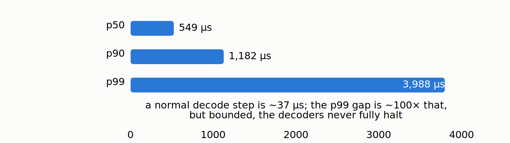

# The prefill that freezes your decoders, and the flag that mostly fixes it

*Part 2 of "The Inference Wall". Same rig as Part 1: Qwen3.5-4B, fp16, one NVIDIA A10G
(23 GB), under real load.*

*Manas Pathak · August 25, 2026*

When you self-host a language model, the server does not answer one request at a time. It
runs many requests together on the GPU at once, which is the whole reason one GPU can
serve many users. But sharing has a downside: one request can degrade the experience of
every other request sharing the GPU with it, without anything crashing or erroring. This
post is about the most common version of that problem, one big request quietly freezing
everyone else's answer mid-sentence, and about the one setting that controls it.

Concretely, picture a chat server. Most requests are short and already streaming their
answers back word by word. Then one user pastes in a 6,000-word document and asks for a
summary. Watch what happens to everyone else: their streams *stall*. Tokens that were
arriving every 20 milliseconds suddenly take most of a second to show up. The users who
did nothing wrong feel the model "stutter," and it is entirely the fault of the one big
request that arrived.

Here is the result this post lands, measured on the same rig as Part 1: **one 6,000-token
prompt dropped into a stream of short requests inflates the worst-case stutter of every
other request on the server into most of a second, and flipping a single scheduler setting
cuts that back by about 2.4x.** Then we open a profiler trace and watch the freeze happen kernel by
kernel. (If you have not read [Part 1](https://mapathak-commits.github.io/inference-wall/articles/part-1/), all you need is its punchline: this 4B model, on one
mid-range GPU, is slow enough per token that a big prompt is genuinely expensive, which is
exactly why this effect is visible at all. More on that at the end.)

## Why a big prompt freezes everyone else

Recall the two phases from the [primer](https://mapathak-commits.github.io/inference-wall/articles/primer/): **prefill** reads a whole prompt in one dense burst
(so a long prompt is a big, expensive lump of work), while **decode** emits the answer one
cheap token at a time. On this 4B model a decode step is ~20 ms; a 6,000-token prefill dwarfs
it.

The problem is that both phases compete for the same steps. When a fat prefill lands, the
scheduler has to decide: let that prefill occupy whole engine steps while it churns through
6,000 tokens, or *slice* it into chunks and interleave those chunks with the decode steps of
everyone already streaming? If it does the former, every currently streaming request emits no
tokens until the prefill clears. That is the freeze. The victims did nothing wrong; they just
happened to be decoding when a big prompt arrived.

The flag that controls this is **chunked prefill**. On: slice the big prefill and
interleave. Off: let it run in whole steps. Let's measure what it actually buys.

## The experiment: victims and an injected lump

To measure the freeze, the probe plays out exactly the chat-server scenario. It runs **6
short streaming "victim" requests continuously** and records their **inter-token latency
(ITL)**, the gap between consecutive output tokens, which is what a user experiences as
smoothness. Midway through, it **injects a batch of long prompts of about 6,000 tokens
each**, then keeps recording the victims' ITL. The whole thing is run twice: once with the
server started with `--enable-chunked-prefill`, once with `--no-enable-chunked-prefill`, everything
else identical (`max-model-len 8192`). The number that matters is the victims' **ITL p99**:
the worst-case stall the injected prefill inflicts on the requests that were already
streaming.

The clean, reproducible comparison is the **heavy** injection (12 long prompts arriving at
once, run twice for stability):

| Condition | Victim ITL p50 | Victim ITL p99 |
|---|---|---|
| Chunked prefill **ON**, heavy (12) | 21.3 ms | **345 / 348 ms** |
| Chunked prefill **OFF**, heavy (12) | 21.2 ms | **831 / 833 ms** |

Read the p50 column first: it does not move. In the median, both configs stream at about
21 ms per token, and if you only watched average latency you would never know anything was
wrong. **The entire effect is in the tail.** With chunked prefill OFF, the victim ITL p99
is about 830 ms: the worst tokens take most of a second to arrive, because that victim
request was stuck waiting behind a whole monolithic prefill. Turn chunked prefill ON and
the p99 drops to about 345 ms, a **2.4x** reduction in the worst-case stutter. Both runs
land within a few milliseconds of each other, so this is a stable result, not noise.

That is the headline: **on a real model, this one flag cuts the worst-case stutter that
big prompts inflict on everyone else by about 2.4x.**

## The twist: on a small model this flag does nothing

Here is the honest part, and it is where most benchmarks would mislead you. The *same
probe on a smaller model, Qwen2.5-0.5B (a prior-generation half-billion-parameter model I
keep around as a small-scale foil), showed no measurable difference at all.* Chunked
prefill looked like a no-op.

It was not that the flag was broken. It was that on a 0.5B model a decode step is only 3
to 5 ms, and even a monolithic 6,000-token prefill gets absorbed so fast that vLLM's
default scheduler interleaving already hid the whole problem. There was no freeze to fix
because the lump was small relative to nothing.

On the 4B, a decode step is ~20 ms and a 6k prefill is a genuinely heavy chunk, so
whether the scheduler slices it or not becomes visible in the victim tail. **Same
feature, same default, opposite conclusion, purely because the model got bigger.** The
lesson generalizes: whether you can measure a scheduling optimization's benefit depends
on the ratio of the interfering work (the prefill) to the step you are protecting (the
decode). Benchmark it on too small a model and you will "prove" it does nothing.

## An honest measurement trap: how you count the tail changes the answer

There is a subtlety here worth dwelling on, because I got it wrong the first time and only
caught it by re-running with the raw numbers saved. I also ran a **light** injection (3
long prompts instead of 12). At that level, if you compute the p99 over *all* the victim
tokens across the whole run, chunked-prefill-OFF actually looks slightly *better* (about
103 ms) than ON (about 325 ms), the opposite of the real effect.

That is not chunked prefill failing. It is an artifact of how the tail is measured. With
OFF and only 3 injected prompts, the freeze is severe but brief: a handful of victim
tokens stall for ~800 ms, but there are so few of them, against ~1,900 total streamed
tokens, that they fall *outside* the worst 1% and never reach the p99. ON, by contrast,
spreads a milder ~300 ms elevation across many more tokens, so its p99 sits higher even
though no single token ever stalls as badly. Restrict the measurement to the injection
window (the tokens actually streaming while the prefill is in flight) and OFF's p99 jumps
back to ~825 ms, exposing the real stall.

The lesson is a benchmarking one, not a chunked-prefill one: **a percentile is only
meaningful relative to the population you compute it over.** A rare severe stall can hide
under an overall p99 while dominating a windowed one. The heavy-injection comparison above
avoids the trap entirely, because enough tokens are affected that the stall shows up no
matter how you slice it, which is exactly why it is the number to trust and the one to
headline.

## The trace: showing the freeze instead of inferring it

The ITL numbers *imply* the prefill stalls the decoders. A trace *shows* it. Serving was
re-run with vLLM's torch profiler armed, one ~6k-token prompt injected amid 4 steady
victim decode streams (a separate, lighter capture run than the 6-victim probe above, kept
small so the trace stays openable in `chrome://tracing`), and the profiler stopped after a
few engine steps. It captured **36,794 GPU kernel
events**, and three things fall out of them.

**1. The hybrid architecture is legible in the kernel mix.** (A kernel is one unit of work
the GPU runs; the trace is just the list of them. The kernel *names* below are vLLM's
internal labels, and you do not need to decode them, only to notice which layer type each
belongs to.) The decode streams run `fused_recurrent_gated_delta_rule` kernels, which are
the linear-attention layers doing their fixed-size-state update from Part 1 (DeltaNet is the
name of that layer family): **408 calls, averaging 37 microseconds each.** The injected
prefill runs `chunk_gated_delta_rule` / `chunk_fwd` kernels, the same layers processing a
whole prompt in bulk rather than one token at a time: **13,905 calls, about 1.74 seconds of
CUDA time total.** That single 6k-token prefill issues roughly 34x more kernel *launches*
than the entire decode stream it is crashing into. It really is the heavy lump the ITL tail
implied, and you can count it.

**2. The freeze is the gap between consecutive decode kernels.** If you measure the idle
time between successive `fused_recurrent_gated_delta_rule` decode kernels, which is the
GPU-level proxy for victim ITL, you get **p50 549 microseconds, p90 1,182 microseconds, p99 3,988 microseconds** (about 4 ms).

With chunked prefill on, the decode kernels keep
firing *through* the prefill rather than halting, but the gap between them stretches at the
tail as the scheduler interleaves prefill chunks. This is a lighter, separate capture than
the client-side runs above (one prompt, 4 victims, a few steps, kept small so the trace
opens), so its absolute numbers do not line up with the 345 ms client tail, and they should
not. What matches is the *shape*: on the GPU, exactly as at the client, the decode steps
stay elevated but bounded rather than stopping dead. The mechanism is not inferred from the
client numbers alone, it is visible directly in the kernel timeline.

**3. Full and linear layers, side by side.** Only the 8 full-attention layers show the
classic `flash` / `varlen_fwd` attention kernels (FlashAttention, the standard kernel for
the growing-KV kind of attention); the 24 linear-attention layers show the DeltaNet kernels
and no growing-KV attention at all. The split between the two kinds of layer is legible
directly in the kernel mix. This is the same hybrid architecture that gave the model its generous KV
budget in Part 1, now seen from the GPU's side.

## What to take away

1. **Averages lie about scheduling problems.** The victim p50 was flat at 21 ms in every
   config; the entire story was in the p99. If you monitor mean ITL you will never see a
   prefill freeze, and your users will.
2. **Chunked prefill is worth having on a real model.** Under heavy prefill load it cut
   the victim tail by about 2.4x (roughly 830 ms down to 345 ms). It is on by default in
   vLLM's V1 scheduler for good reason; the value is in protecting streaming requests from
   fat incoming prompts.
3. **A percentile means nothing without the population behind it.** The light-injection
   result flipped sign depending on whether the p99 was computed over all tokens or just
   the injection window. Before you trust a tail number, ask what set of samples it was
   computed over.
4. **Whether an optimization "works" depends on the model scale you test it on.** The
   exact same flag was un-measurable on a 0.5B and clearly beneficial on a 4B. Always ask
   whether your test model is big enough for the effect you are trying to measure to
   exist.
5. **Traces turn "I think it stalls" into "here is the gap."** The kernel counts (a single
   6k prefill issuing ~34x more kernel launches than the whole decode stream) and the
   decode-to-decode gap distribution show the *same shape* the client-side ITL did: the
   stall is real and it is bounded, not a full halt. When an independent trace shows the same
   mechanism the client numbers implied, you can trust it.

Next in the series, coming next week: the flag from this post protected the decoders from
*one* fat prompt, but the deeper lever is running many requests together at all. I turn
batching off entirely and watch throughput fall off a cliff, then measure exactly what
running requests side by side buys you and where that stops helping.

---

*Reproduce: `chunked_prefill_probe.py`, `capture_trace.py`, and the server launch script
are in
[`experiments/02-prefill-freeze/`](https://github.com/mapathak-commits/inference-wall/tree/main/experiments/02-prefill-freeze);
the probe logs, the op-table summary, and the captured `chunked_prefill_trace.json.gz`
(openable in `chrome://tracing`) are in
[`benchmarks/02-prefill-freeze/`](https://github.com/mapathak-commits/inference-wall/tree/main/benchmarks/02-prefill-freeze).
Single A10G; your absolute numbers will differ, the shape will not.*

*Reading the trace yourself: the quickest visual is to gunzip it and open the `.json` in
`chrome://tracing` or [ui.perfetto.dev](https://ui.perfetto.dev). For numbers rather than
pictures, query it with the [`perfetto`](https://pypi.org/project/perfetto/) Python package
(`pip install perfetto`), which runs PerfettoSQL over the trace: `TraceProcessor(trace=...)`
then, e.g., `select name, count(*), sum(dur) from slice group by name order by 2 desc` gives
the kernel-family counts and CUDA time (slice `dur` is nanoseconds). Every trace-derived
number in this post is reproduced by the scripts in the experiments folder: `tp_verify.py`
(kernel-family counts and the decode-to-decode gap percentiles), `tp_gap_reconcile.py` (the
gap figure is the idle time from the end of one `fused_recurrent_gated_delta_rule` decode
kernel to the start of the next), and `tp_occupancy.py` (the GPU-busy fraction). No GPU is
needed to read a captured trace, only to record one. If you would rather not install
anything, the raw `.json` is a Chrome-trace event list you can parse with the standard
library (each GPU kernel is an event with `cat == "kernel"`, a `ts`, and a `dur`).*

---

**Previous:** [Part 1 — An 8.6 GB model that serves only 7 requests a second](https://mapathak-commits.github.io/inference-wall/articles/part-1/) · **Next:** Part 3 (coming next week)

---

*Disclaimer: This blog is written and published in my personal capacity. The opinions,
findings, and conclusions expressed herein are solely my own and do not necessarily
represent the views, policies, or endorsements of my current or past employers.*
