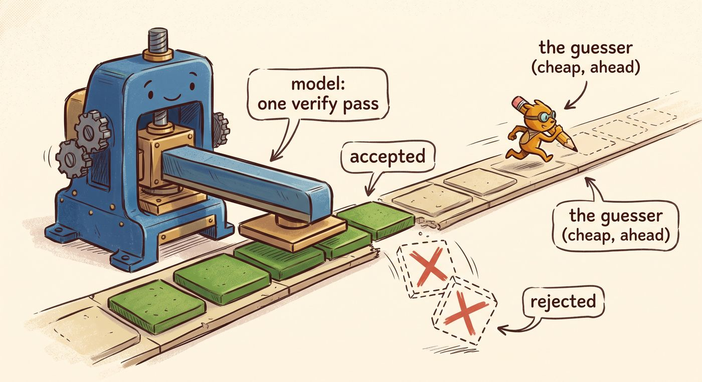
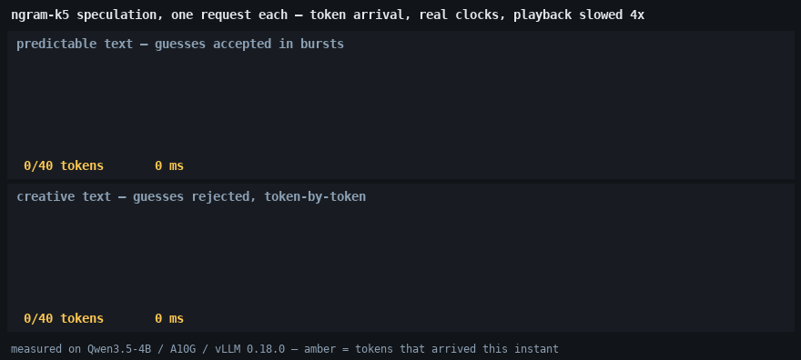
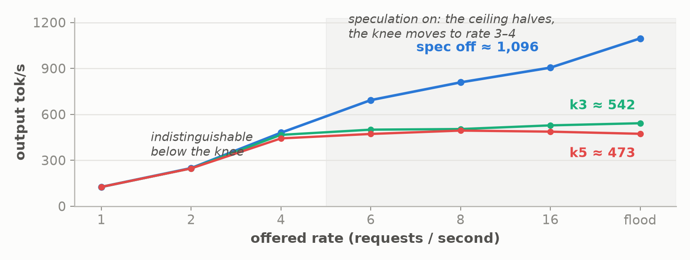
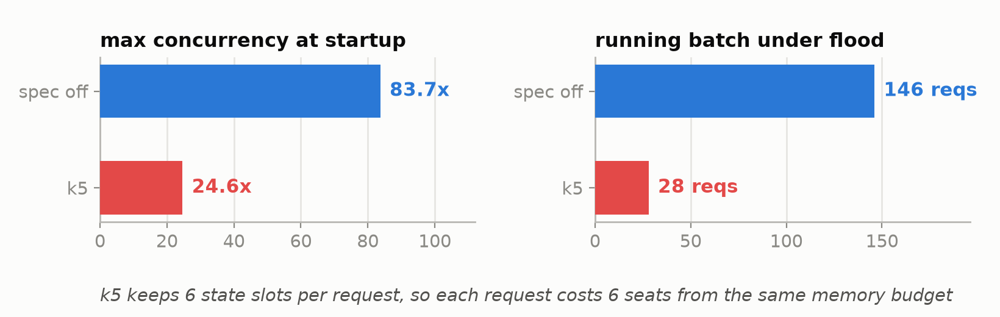

# The optimization that speeds up an idle server and slows down a busy one

*Draft 2, rev 4. Part 6 of "The Inference Wall." Same rig as the whole series:
Qwen3.5-4B, fp16, one NVIDIA A10G with 23 GB, measured under real load.*

---

There is a flag in vLLM that is supposed to make your model generate faster. The papers
behind it report 2x-and-better speedups, the blog posts call it close to free, and it
takes one line of config to turn on. I turned it on. On a quiet server it delivered:
single-request generation ran up to **1.8x faster**. Then I put the same server under
production-style load, and the same flag **cut total throughput from ~1,100 tokens a
second to ~490**, while time-to-first-token went from 5 seconds to 22. Same model, same
GPU, same flag: whether it speeds you up or halves your capacity depends on how busy the
server is, and nothing in the documentation warns you which side of that line you are on.

The flag is **speculative decoding**. This post measures both of its faces, explains the
inversion through two measurable mechanisms, and ends at a profiler trace showing that
the flag does something more drastic than advertised: it replaces the model's decode
loop with a different machine.

If you have not read the earlier parts, one fact carries everything below, and it was
measured in [Part 1]: generating text is *memory-bound*. To produce each token of the
answer, the GPU must stream the model's entire weights, 8.6 GB for the model used
throughout this series, out of its memory, and that streaming is what a token costs. On
this rig, about 20 ms. Every real speedup in serving is some way of getting more tokens
out of one stream of those bytes. Batching shares one stream across many users'
requests; that was [Part 3]. Quantization shrinks the bytes in the stream; that was
[Part 5]. Speculative decoding is the third lever: getting several tokens *of the same
request* out of one stream. That is the whole frame you need. The rig is one NVIDIA
A10G with 23 GB serving Qwen3.5-4B in fp16, and every number here is measured on it,
warm, under real load.

## The trick, with names for the moving parts

<!-- DIAGRAM D9 HERE: generated from the prompt in DIAGRAM-PROMPTS-P6.md
     (source diagram_prompt6.jpeg, compressed to d9.jpg at series standard).
     Vector fallback: d9-speculation-cartoon.png via render_spec_cartoon.py. -->

Call the model you are serving **L**, for large. Why must L pay one full weight-stream
per token, instead of producing the whole answer in one go? Because each token of the
answer is an *input* to the next one: token 13 cannot be computed until token 12 exists.
A prompt's tokens all exist up front, which is why reading a prompt is fast; an answer's
tokens do not. One token, one pass, one 8.6 GB stream: the 20 ms floor.

But there is an asymmetry hiding in that constraint. *Producing* a token costs L a full
pass, yet *checking* a proposed continuation is nearly free: given k proposed tokens, L
can run **one** forward pass over all of them at once, exactly as if they were a k-token
prompt, and that single pass reveals what L itself would have produced at every one of
the k positions. One weight-stream, k verdicts.

Speculative decoding exploits that asymmetry with a second, cheap guesser, **S**, for
small:

1. **S proposes** the next k tokens. The depth k is the knob you set; this post tests
   five and three, written **k5** and **k3** from here on.
2. **L verifies** all k proposals in one shared pass.
3. Walk the positions in order: while S's token matches what L would have said,
   **accept** it. At the first mismatch, discard that guess and everything after it,
   take L's own token for that position, which the verify pass already computed, and go
   back to step 1.

If all k guesses are right, one weight-stream bought k+1 tokens. If the first guess is
wrong, the pass bought exactly what a normal decode step buys, one token, plus the
wasted work of checking dead proposals. The whole economics of the trick reduces to one
number, the **acceptance rate**: what fraction of S's guesses survive verification.

The idea comes from two 2023 papers, by
[Leviathan, Kalman and Matias at Google](https://arxiv.org/abs/2211.17192) and by
[Chen et al. at DeepMind](https://arxiv.org/abs/2302.01318), which both report roughly
**2 to 2.5x** single-stream speedups with a small draft model. Those are the numbers the
folklore rounds up from, and it is worth noting what they measured: one request at a
time, a well-matched drafter, and generation tasks the drafter could predict. All three
qualifiers will matter below.

## What S is in this experiment, and what "ngram" actually means

The classic S is a small language model from the same family, maybe one-tenth of L's
size, loaded onto the same GPU alongside L. A 0.5B drafter next to this 4B would fit
easily: both simply occupy memory, and the server runs S's cheap pass before each of L's
verify passes. vLLM 0.18 supports that, plus trained-guesser variants like
[EAGLE](https://arxiv.org/abs/2401.15077) and [Medusa](https://arxiv.org/abs/2401.10774)
that bolt a small guessing head onto L itself.

This post uses the simplest S available, and it is important to be precise because the
name misleads. vLLM's **ngram** method, also known as
[prompt lookup decoding](https://github.com/apoorvumang/prompt-lookup-decoding), is
**not a language model and keeps no table of n-gram statistics**. It is a string search
over text this request already has. Take the last few tokens just generated; the server
tries phrase lengths from four down to two, the `prompt_lookup_max` and
`prompt_lookup_min` settings. Scan backwards through this request's own prompt-plus-output
for an earlier occurrence of the same phrase. If found, propose the k tokens that
followed it last time. Copy-paste as prophecy. It costs no extra memory beyond the
context the server already holds and no compute worth naming, which makes it the
cleanest possible probe: **everything measured below is the cost and benefit of L's
verification machinery**, with S's cost pinned at zero. A real draft model would change
the guess quality, not the cost structure of checking.

The acceptance behavior is intuitive. Text that repeats itself is easy to look up:
boilerplate, code, structured output, a document being quoted back. Novel prose is
impossible. The two probe prompts below sit at those poles on purpose.

## The good end: one request on an idle server

Single stream, temperature 0, 160 output tokens, three repetitions, spread under 1%:

| Prompt | Spec off | k5 = guess 5 ahead | k3 = guess 3 ahead |
|---|---|---|---|
| predictable, repeat a sentence | 20.05 ms/token | **11.2 ms/token, 1.79x** | 12.25, 1.64x |
| creative, a surreal poem | 20.05 ms/token | 19.4, no change | 21.9, **0.92x, a real penalty** |

The baseline column is Part 1's floor re-measured: 20.05 ms per token, dead flat,
because a plain decode step costs one weight-stream no matter what the token says.
Speculation breaks the flatness in both directions: 1.8x on text the lookup can predict,
nothing on text it cannot, and at k3 a real 8% penalty, the proposal-and-verify
machinery paid for and never once useful.

What this feels like at the token level is worth seeing rather than describing. The
animation below replays both prompts against the k5 server using the measured arrival
process: bursts of about three tokens every 36 ms in the top pane, a steady one token
per 19 ms in the bottom. Playback is slowed 4x; the clocks are real.

<!-- ANIMATION HERE: spec-token-stream.gif (rendered by render_spec_animation.py from
     the measured rates; regenerate rather than edit). Two panes, one request each:
     predictable text arrives in accepted bursts and finishes at 471 ms; creative text
     ticks one token at a time and finishes at 776 ms. -->

An honest aside on the 1.8x, because the cited papers say 2 to 2.5x and toy benchmarks
say more; an earlier small-model study of mine clocked this same ngram method at 3.7x on
a purely repetitive prompt. The repeat-a-sentence prompt looks like it should accept
everything, and early in the answer it does. But this model drifts into free-form
reasoning text partway through the generation, which a string lookup cannot predict, and
over the full run the speedup works out to a **mean accepted length of about 2** per
verify step, out of a possible 6. A probe that catches only the early, fully-accepted
window reports 4x and is wrong as a steady-state number. The 1.8x is what a real
160-token generation got.

## The bad end: the same flag on a busy server

Now the series' standard measurement: a fixed workload of 256 input and 128 output
tokens, randomly generated, the request rate swept from 1 per second to a flood, 200
prompts per point, warm server. Random tokens are the acceptance-hostile extreme, and
the server metrics confirm it: in the k5 arm, the guess-5 configuration, **about 21% of
drafted tokens are accepted**. Output tokens per second:

| Offered rate | Spec off | k5 | k3 |
|---|---|---|---|
| 1 | 126 | 126 | 126 |
| 2 | 249 | 247 | 247 |
| 4 | 480 | 443 | 466 |
| 6 | 693 | 472 | 500 |
| 8 | 809 | 494 | 504 |
| 16 | 905 | 487 | 528 |
| flood | **1,096** | **473** | **542** |

<!-- FIGURE P6a: rendered by render_spec_figures.py; regenerate rather than edit. -->

Below the knee, nothing: at rates 1 and 2 the three servers are indistinguishable,
because the GPU has idle headroom and wasted verification vanishes into it. From rate 4
the speculation arms fall behind, and past the knee they collapse. Under flood, k5
sustains **473 tokens a second against the baseline's 1,096**, less than half. Re-run
for stability, the k5 flood point landed at 491 and 493 against a baseline of 1,097 both
times, a 2.2x gap. Median time-to-first-token under flood: 22 seconds versus 5. The knee
itself moves from rate 6-to-8 down to between 3 and 4, so the flag did not just lower
the ceiling, it halved the healthy operating range. The k3 arm shows the dose-response:
guess less, waste less, 542 versus 473 at flood, but still lose half the server.

One more probe separates the two variables at play, load and workload. Hold the load
fixed at 32 simultaneous requests and change only the text:

| 32 concurrent requests | Spec off | k5 | k3 |
|---|---|---|---|
| predictable text | 1,035 tok/s | 1,183, up 14% | 1,293, up 25% |
| creative text | 1,071 tok/s | **577, down 46%** | 811, down 24% |

Read the off column first: a plain server does not care what it writes, 1,035 against
1,071. The speculation columns swing by 2x between the same two rows. Same server, same
concurrency, same flag; the only difference is whether the guesses land. **Under load,
acceptance rate decides the sign.**

## Why it inverts, mechanism 1: speculation multiplies the work batching cannot share

To follow this you need one fact from Part 3, restated plainly. A decode step's work has
two parts:

- **Shared:** streaming the 8.6 GB of weights. One stream serves the whole batch,
  whether 1 request or 146 are riding it. This is the part batching amortizes.
- **Private:** each request must also process the new token *against its own
  conversation memory*, the cached history that belongs to that request alone. Your
  request's history is different data from mine, so this work cannot be shared or
  amortized; the step pays it once per request, every step.

Part 3 measured the consequence: as the batch grows, the shared stream is split ever
thinner while the private work accumulates per request, and at a batch of about 61 the
private work becomes what fills the step. A loaded server lives past that point. Its
steps are already full of private work.

Now watch what speculation does to each part. The shared stream it leaves alone; that is
the whole trick, same stream, more verdicts. The **private work it multiplies by k+1**:
at k5, verifying a request means processing six positions against that request's private
history instead of one. On an idle server the multiplied private work hides in the
stream's shadow, which is why rates 1 and 2 showed no cost. On a loaded server the
private work *is* the step, there is no shadow, and multiplying it by six while only 21%
of positions survive verification means most of every step is spent computing verdicts
for tokens that get thrown away. Each wasted position displaces a real one.
**Speculation and batching compete for the same headroom, and under load batching has
already spent it.**

## Why it inverts, mechanism 2: the guessing eats the server's seats

The second mechanism was not in the plan; the startup log forced it into the post. To
discard a wrong guess, the server must be able to *rewind* the model's internal state to
before the guess. For most of a transformer that is trivial: the model's memory of the
conversation is a per-token cache, the KV cache, and rewinding three tokens means
truncating three entries. But Qwen3.5 is a *hybrid-attention* model. Only 8 of its 32
layers keep that per-token cache; the other 24 keep a **fixed-size recurrent state**
instead, a single running summary that is overwritten as each token is processed. A
running summary has no entries to truncate. Once updated, the old state is gone. vLLM's
solution is checkpointing: with k5 armed, it budgets **six state slots per request**,
one per speculated position plus the base, so any prefix can be restored.

Those slots come out of the same fixed memory budget that determines how many requests
the server can hold at once. Speculation just multiplied each request's share of it by
six, and the effect shows up at startup, before a single request is served:

| | Spec off | k5 |
|---|---|---|
| Max concurrency, from vLLM's startup log | **83.71x** | **24.64x** |
| `Running:` under flood, from the scheduler log | **146 reqs** | **28 reqs** |

<!-- FIGURE P6b: rendered by render_spec_figures.py; regenerate rather than edit. -->

The speculating server admits 28 concurrent requests where the plain server ran 146, and
parks the rest in a waiting queue. Readers of Part 4 will recognize the signature: when
this scheduler cannot fit another request's memory, it does not crash or evict, it
quietly stops admitting, and the tell is a `Running:` count pinned far below the
configured cap while `Waiting:` piles up. In Part 4 it took a deliberate 15x cache cut
to force that behavior. Here an optimization flag did it. And the price is set by the
batching arithmetic above, before a single wasted draft is counted: 28 requests sharing
each weight-stream cannot approach the throughput of 146 sharing it. The two mechanisms
compound, wasted verdicts inside each step and fewer requests allowed into the step, and
together they are how a "speedup" halves your throughput.

## The trace: speculation does not decorate decode, it replaces it

The numbers are above; here is the trace that shows the machine making them. The
capture: eight long-lived predictable-text decoders against the k5 server, profiler
window with no arrivals, 35,202 GPU kernels over two seconds.

The most surprising line in the analysis: the decode kernel this series has leaned on
since Part 1, the one-token-per-pass linear-attention recurrence named
`fused_recurrent_gated_delta_rule`, appears in this trace **zero times**. Every step
instead runs the *multi-token* variant of the same layer,
`fused_sigmoid_gating_delta_rule_update`: 1,320 calls, which at 24 linear-attention
layers per pass is exactly 55 engine steps. Turning on speculation does not bolt some
machinery onto the decode loop; it swaps the loop out for a verify loop, a different
kernel doing prompt-reading-shaped work at generation time. Reading a prompt is "one
stream, many tokens"; speculation is generation impersonating that.

The step timing puts the entire trade in two numbers. A verify step takes **36 ms**
where an ordinary decode step at this batch size takes about 20 ms, but it processes six
positions per sequence instead of one: **6 ms per position, versus 20**. There, in one
measurement, is everything the trick promises. And everything it risks: at the flood
workload's 21% acceptance, that same 36 ms step keeps only about two tokens, roughly
18 ms per *accepted* token, the baseline's price paid through a costlier machine, before
the collapsed batch is even counted.

One more honest reading: during verify-heavy decode the GPU is only **80% busy**,
against 97 to 99.7% in Part 1's pure decode loop. The proposer and the accept-reject
bookkeeping between steps leave real gaps. Speculation trades a fully-packed slow loop
for a gappier fast one, and the gaps are part of the price.

## Does it make the answers worse?

No, by construction, and the guarantee is worth understanding because it is also worth
double-checking. The accept-reject rule is designed so that the final output provably
comes from the same distribution L alone would have produced; the proof is in the
[Leviathan et al.](https://arxiv.org/abs/2211.17192) paper. At temperature 0 the
guarantee is easy to see without any math: a guess is accepted only if it is exactly the
token L would have picked, so every token in the final answer is a token L chose. S
never overrules L. It only pre-computes what L was going to say anyway, and when it
guesses wrong, the wrong tokens are discarded before anyone sees them. Speed is the
thing at stake in this trade, not quality.

Two qualifications keep that claim honest. First, "same distribution" does not mean
"same text." Within each server configuration our temperature-0 runs were perfectly
repeatable, three repetitions byte-identical. Across configurations they diverged: the
spec-on and spec-off servers wrote different continuations of the same temperature-0
prompt, and k3 wrote a different poem than k5. Nothing is broken. Verification changes
the shapes of the GPU kernels, kernel shapes perturb logits in their last decimal
places, and at a near-tie a flipped choice cascades into a different continuation, the
same class of nondeterminism that batch size already causes. Neither continuation is
worse; they are different draws from the same model. But if your tests assert exact
strings, this flag will fail them.

Second, the guarantee belongs to the *strict* acceptance rule. Some variants
deliberately relax it to accept more guesses, Medusa's "typical acceptance" being the
best-known example, and a relaxed rule genuinely changes the output distribution. Know
which rule your engine is running before you lean on the proof.

If quality matters enough to verify rather than trust, measure it the way you would
measure any model change, because diffing strings is doomed by the nondeterminism above.
Run the evaluation you already trust, a benchmark suite or an LLM-judged eval, against
the server with the flag off and then on, and compare scores within noise. This study
measured speed and leaned on the strict-acceptance design for the quality claim; an eval
suite is how you verify that claim holds in your own deployment.

## What to take away

1. **Speculative decoding spends idle capacity to buy latency.** Where there is slack, a
   single stream on an otherwise-quiet GPU, it converts unused verify headroom into a
   real speedup: 1.8x here on predictable text. Where there is no slack, the spending
   continues and the buying stops.
2. **Under load it can invert, hard.** On this rig and a low-acceptance workload, the
   flag cut saturated throughput from 1,096 to 473 tokens a second and moved the knee
   from rate 6-to-8 down to 3-to-4. Speculation multiplies exactly the per-request work
   that batching cannot amortize.
3. **On hybrid models, speculation also eats concurrency.** Rewinding recurrent state
   means k+1 state checkpoints per request: max concurrency fell from 83.7x to 24.6x and
   the flooded running batch from 146 to 28, admission control triggered by an
   optimization flag. Check your engine's startup concurrency line before and after
   enabling it.
4. **The decision is a workload measurement, not a belief.** At the same 32-request
   concurrency, the same k5 flag gained 14% on predictable text and lost 46% on novel
   text. The server's own acceptance metrics, drafted versus accepted and the
   per-position rates, tell you where your traffic sits; read them before and after
   flipping the flag, and again when your traffic changes.
5. **Quality is preserved by design; reproducibility is not.** Strict acceptance
   guarantees the same output distribution, and your eval suite can confirm it. Exact
   temperature-0 strings will still change, for the same reason they change with batch
   size.

Part 1's claim gets one more face: inference on this hardware is a bytes-through-memory
problem, and every lever this series has measured, batching, quantization, speculation,
is a different way of getting more tokens out of the same stream of bytes. The first two
spend little and stack cleanly. This one is a bet, placed per token, with the odds set
by your traffic, and the house edge grows with load.

<!-- NEXT-TEASER: to be written once Part 7 is chosen (candidate: the same knobs on
     other serving engines, SGLang / TensorRT-LLM, using the trt/ groundwork). -->

---

*Reproduce: the A/B driver `run_spec_study.sh`, the probe and follow-up scripts, the
verify-step trace `spec_verify_trace.json.gz` openable in `chrome://tracing`, the trace
analyzers `tp_spec_kernels.py` and `tp_spec_steps.py`, the animation renderer
`render_spec_animation.py`, and all raw logs, `spec_study.log`, `spec_followup.log`, and
the per-arm `server_*.log` files carrying the acceptance metrics and `Running:` lines,
are in the companion materials for this part. Single A10G, vLLM 0.18.0; absolute numbers
are rig-specific, the inversion and its two mechanisms are not.*

*Further reading: the two founding papers,
[Leviathan et al., "Fast Inference from Transformers via Speculative Decoding"](https://arxiv.org/abs/2211.17192)
and [Chen et al., "Accelerating Large Language Model Decoding with Speculative Sampling"](https://arxiv.org/abs/2302.01318);
[prompt lookup decoding](https://github.com/apoorvumang/prompt-lookup-decoding), the
model-free guesser used here; [EAGLE](https://arxiv.org/abs/2401.15077) and
[Medusa](https://arxiv.org/abs/2401.10774), trained-guesser variants; and
[vLLM's speculative-decoding docs](https://docs.vllm.ai/en/latest/features/spec_decode.html)
for the configuration surface.*
