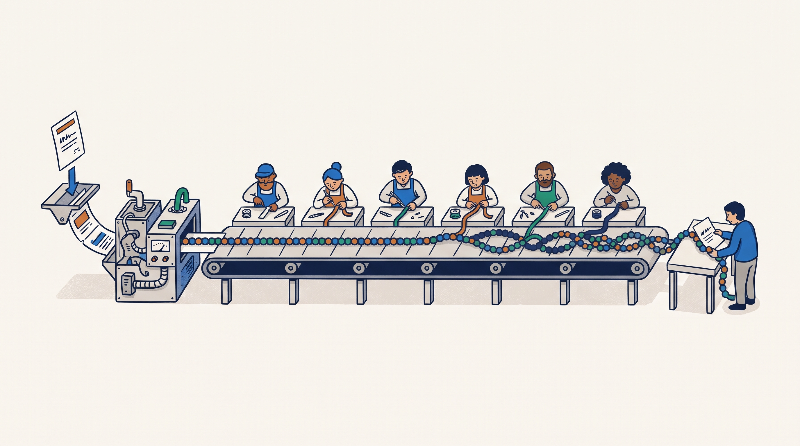

*What a large language model actually computes when it reads your prompt and writes an answer:
how a token becomes a vector, what a transformer block does to it, and how the next token falls
out the end. No benchmarks, no math, no equations. You need to be able to picture what one pass
through the model does.*

*Manas Pathak · September 1, 2026*

# What actually happens inside an LLM

Ask a language model a question and it answers one token at a time, each token produced by
running the whole model once. That single run is a **forward pass**, and this post is about what
happens inside it: what the model is doing between the moment your prompt goes in and the moment
the next token comes out. The picture is smaller than it looks from outside, and once you have it,
a lot of the model's behavior that seemed arbitrary turns out to follow directly from how it is built.

A note on scope before we start. This is a picture, not a specification. It deliberately skips the
notation, the linear algebra, and a good deal of the engineering, and in a few places it says
"this is roughly what happens" where the truth is more involved. The goal is to give you a working
sense of what a model does under the hood, solid enough to reason with; where you want the exact
version, the papers and surveys linked along the way have it.

Two facts in particular seem arbitrary from outside, and this post pays off both by the end:

- **Why generating a token does not require rereading the whole conversation.** The model computes
  a key and a value for each token once and reuses them forever after.
- **Why reading a long prompt gets disproportionately expensive.** One specific step, attention,
  does an amount of work that grows with the *square* of the prompt's length, while the rest of the
  model grows only in a straight line with it. That square-law is a property of the plain algorithm
  we walk through here, and it is the right way to understand *why* attention is the expensive part.
  In practice, production inference systems do not run attention exactly this way: methods like
  FlashAttention compute the same result without ever building the full square grid in memory, so
  their memory cost stays linear even though the arithmetic is still quadratic. We come back to that
  at the end.

Both facts fall out directly from how the model is built, and both are visible by the last section.

This is a self-contained tour of the model itself. If you also want the serving side, how a GPU
spends its time and memory turning these forward passes into a live service, the
[first primer](https://mapathak-commits.github.io/inference-wall/articles/primer/) covers that and
treats the forward pass as a black box this post opens.

## The shape of one forward pass

*The forward pass as an assembly line: a word goes in as a rough stone, is faceted and polished bench by bench until the last worker can read it, and the next word comes off the end.*

Start from the top, before any detail. The unit the model works in is the **token**: a short chunk
of text, often a whole word but sometimes a word-piece or a punctuation mark. The model never sees
letters or words as such; it sees a sequence of tokens, and it produces one token at a time. To
produce the next one, the model does three things in order:

1. **Turn each input token into a vector.** Each token is converted into a vector. From here on the
   model works only on these vectors, never on the text directly.
2. **Push the vectors through a stack of identical blocks.** Each block reads the current vectors
   and rewrites them, adding a little more information about what each token means *in the context
   of the others* and what is likely to come next. This is where nearly all the weights, and
   nearly all the time, go.
3. **Turn the last vector into a guess at the next token.** After the final block, the vector
   sitting at the most recent position is converted into a score for every possible next token,
   and the highest-scoring candidates are the model's prediction.

That is the entire forward pass. A model runs it in two modes: **prefill** runs all three steps
over every prompt token at once, and **decode** runs them over a single new token at a time while
reusing stored work for the rest. Everything below is a
zoom into step 2, because that is the step with the structure worth understanding. We build up one
block, then stack it.

> 📊 **[Diagram DA — the whole pass, with one block opened]** — *top: `prompt tokens → embed → vectors → a stack of N blocks → final vector → score + softmax → probabilities over the vocabulary`. Below, a dotted callout pulls one block out of the stack into a big inset: inside it, vectors flow through an `attention` box where arrows cross between token positions (they mix), then a `feed-forward` box of straight parallel lanes, each token on its own — "attention (tokens mix) then feed-forward (each token alone), repeated N times."*

## From tokens to vectors: the embedding

The model keeps a large table with one vector for every token in its vocabulary, learned during
training. That vector is the token's **embedding**, and it stands in for the token. Turning the
prompt into vectors is a table lookup, one embedding fetched per token, with nothing computed yet.

One property of that vector matters for everything that follows: its size never changes as it
moves through the model. It enters the first block, leaves the same size, enters the next block the
same size, and comes out of the last block still the same size. A block never grows or shrinks the
vector; it only **rewrites the numbers in place**, adjusting them so they carry a bit more meaning.
So picture one vector per token, handed from block to block, revised at each step and passed along.
That handoff is the thread the rest of this post follows.

## What a transformer block does

Right after the lookup, a token's vector depends only on the token itself, not on where it sits or
what surrounds it. Consider the token "bank": at this point its vector is the same whether the
sentence is "the river bank" or "the savings bank," because the lookup has no way to see the rest
of the sentence. But predicting the next token requires knowing which meaning is in play, and that
is fixed entirely by the surrounding tokens. So a block's job is to update each token's vector
using information from the other tokens, and it does this in two distinct operations run back to
back:

1. **Attention** is the only operation in the whole model that moves information *between* token
   positions. It replaces each token's vector with a mixture that draws in information from the
   earlier tokens relevant to it. Everywhere else, positions are processed in isolation; attention
   is where they interact.
2. A **feed-forward network** then processes each token's vector *on its own*, with no reference to
   any other position: the same two-layer network applied independently at every position. This is
   where most of the model's weights sit, and where the model does the bulk of its per-token
   computation on the context attention just gathered.

The order is deliberate. Attention first collects the relevant context into each token's vector;
the feed-forward network then transforms that now-contextual vector. A block is exactly this pair,
**attention then feed-forward**, and it is the unit that repeats. The next two sections take each
operation in turn.

## Attention: a weighted average each token computes for itself

Here is the whole operation in one sentence, then the parts. **Attention rewrites each token's
vector as a weighted average of vectors drawn from the earlier tokens, where each token decides
for itself how much weight to put on each of the others.** The only real question is where those
weights come from, and that is what the query, key, and value are for.

An analogy first, because the three-way split is the part that tripped me up when I first learned
this. Think of searching for a book in a library. You walk in with a **query**, a description of
what you are after. Every book on the shelf has a **key** printed on its spine, a short description
of what it is about, written in the same vocabulary as your query so the two can be compared. You
match your query against every spine, and the books whose keys fit best are the ones you pull down.
What you actually read and take away is not the spine label but the book's contents, its **value**.
Query is what I'm looking for, key is what I advertise, value is what I hand over. The rest of this
section is that same idea made mechanical, so take the three names on faith for a moment; the way
they fit together will be concrete by the end of the section.

*Attention as a library search: you match your query against every spine, pull the books whose keys fit best, and blend their contents — the values — into one new page.*

Now the mechanism. From each token's current vector, the block computes three new vectors by
multiplying it against three separate learned weight matrices. "Computes a description" here just
means it produces another vector, one whose role is set by which matrix made it:

- the **query**: what this token is looking for in the tokens before it,
- the **key**: what this token offers, written so that it can be compared against a query,
- the **value**: the information this token will contribute to any token that attends to it.

To update token number 50, the block takes token 50's **query** and compares it against the
**key** of every token from 1 to 50. The comparison is a dot product, which is large when two
vectors point in similar directions and small when they do not, so it measures how well token 50's
query lines up with each earlier token's key. That produces one raw score per earlier token: how
relevant is that token to what token 50 is looking for.

Those raw scores are not yet usable as averaging weights: some are negative, and they do not add up
to anything in particular. **Softmax** is the step that turns them into weights, converting the row
of raw scores into a set of proportions that are all positive and sum to one. The row now reads as
something like "70% of my attention on this token, 20% on that one, the rest spread thin." It also
sharpens the contrast, so a clearly-best match dominates the blend while weak matches contribute
almost nothing. Whenever you see softmax in this post, read it as "turn a list of scores into a
list of probabilities."

> 📊 **[Diagram DB — attention's mechanism, and why the cache exists]** — *updating token 50 in three stages: **score** (token 50's query · the key of every token 1..50 → a raw number each) → **softmax** (those numbers become weights that sum to 1, one dominant) → **weighted sum** (each token's value, scaled by its weight, summed into token 50's new vector). A bracket under it notes: only the earlier tokens' keys (to score) and values (to average) are needed again, so those are stored — the KV cache — while the query is used once and discarded.*

The last step is the average itself. The block takes each earlier token's **value** vector, scales
it by that token's softmax weight, and adds them all up. The result is one blended vector, made
mostly of the values of the tokens token 50 found most relevant, and that blend is written back as
token 50's updated vector. This is the operation the
[transformer paper](https://arxiv.org/abs/1706.03762) introduced, and its title is the claim
itself, that attention is enough to let tokens share information.

To restate the whole thing in one line: each token uses its **query** to score every earlier
token's **key**, softmax turns those scores into weights, and the token's new vector is the
weighted blend of the earlier tokens' **values**. That is attention, start to finish.

### Why this is exactly what the KV cache stores

Look at what updating a token needs from the past: the **keys** of the earlier tokens, to score
them, and their **values**, to average them. It never needs their queries. A token's query is used
only to update that same token, never to be looked at from elsewhere. And the key and value a token
produces at a given block do not change once computed: token 50's key at block 3 is the same
whether the sequence is 51 tokens long or 5,000.

So the model computes each token's key and value once, the first time it processes that token, and
keeps them. That store is the **KV cache**. When the model later generates token 5,000 it does not
rerun tokens 1 through 4,999; it processes only the new token, forming that token's query, key,
and value, then scores its query against the 4,999 keys already saved plus its own. The new
token's key and value are added to the cache for the tokens that come after it, and its query is
used once and discarded. Compute each token's key and value once and keep them, never recompute
the past: the cache is not a bolt-on optimization, it falls straight out of how attention is
defined.

### Many comparisons in parallel: attention heads

A block does not run a single query-key-value comparison. It runs several in parallel, each with
its own query, key, and value matrices, called attention **heads**. One head might learn to track
the immediately preceding token, another the last time the subject was mentioned, another matching
brackets or quotation marks. Each head does its own scoring and averaging over the whole sequence,
the results are combined, and the vector moves on. The reason it matters for cost: the KV cache
holds a separate key and value for *every head of every block*, which is why cached tokens add up
in memory as quickly as they do.

One constraint has been quietly doing work this whole time: when updating token 50, the block
scores it against tokens 1 through 50, never against tokens that come after. A token is only ever
allowed to look backward, because at generation time the later tokens do not exist yet. This is
**masked** (or **causal**) attention, and the mask is exactly what enforces "earlier tokens only"
in every score above.

## The feed-forward network: computing on what attention gathered

After attention, each token's vector carries information about its context. The second operation
in the block is a **feed-forward network**, also called the **MLP** (multi-layer perceptron): two
large weight matrices with a simple nonlinear function between them, applied to each token's vector
independently. It takes the contextual vector attention produced and transforms it, position by
position, with no further mixing between positions.

Its mechanics are simpler than attention's, but do not read that as unimportant: in a typical block
the feed-forward network holds about two-thirds of the weights to attention's one-third, so on a
real GPU it is where most of the work of a forward pass ends up, and it is where a lot of what the
model *knows* is stored. A rough way to hold the division of labor: attention is where tokens work
out how they relate to each other, and the feed-forward network is where the model does its thinking
about what the result means. The one distinction to keep is that this operation is strictly
per-token, where attention was strictly about tokens interacting.

## Stacking blocks

A model is a stack of these blocks, one after another. There is no variety in the wiring: every
block is built identically, attention then feed-forward. Small models stack a dozen or so; most
current LLMs run somewhere between about 32 and 126 of them, with the largest at the top of that
range. What differs between blocks is the learned weights, and so what each block does to the
vector. Early blocks tend to resolve local, grammatical structure; later blocks assemble
longer-range meaning.

Each block reads the vectors the previous block wrote and edits them a little further. One detail
keeps the repetition from washing out: a block *adds* its result into the vector rather than
replacing it, so what an early block established survives to the end unless a later block
deliberately overwrites it. That is what lets dozens of rounds of editing accumulate into a
sharper and sharper representation instead of blurring into noise.

## Turning the last vector into the next token

After the final block, the vector at the most recent position holds a heavily revised
representation of that token in its full context. Turning it into an actual next token is what the
phrase **next-token prediction** names, and it is a smaller step than it sounds.

The model multiplies that final vector by one last large matrix, which produces a single number
for *every* token in the vocabulary: a score for how well each one fits as the continuation. A
softmax turns those scores into a probability for each candidate, the same trick as before, used
here to turn scores into a probability distribution rather than averaging weights. That
distribution is the model's entire output: not a word, but a probability spread across the whole
vocabulary. "The model predicts the next token" means exactly this, a ranked list of candidates
with probabilities attached.

Picking an actual token from that distribution is a separate, cheap step called **sampling**, and
it is where knobs like *temperature* live: take the single most probable token, or roll a weighted
die over the top few. The token that comes out is fed back in as the newest input, and the whole
pass runs again for the token after it. That feedback loop, one full forward pass per output
token, is the decode loop, now with its insides visible.

## The two phases, from the inside

> 📊 **[Diagram DC — prefill vs decode attention]** — *two panels, same cell style. LEFT (prefill): a filled N×N grid — every prompt token scores every earlier one — "double the prompt, quadruple the work." RIGHT (decode): a single row — one new query against all stored keys — "linear per step, but paid again for every token generated." The grid-vs-row contrast is the point.*

With the block open, the difference between reading a prompt and generating an answer comes down to
one thing, and it is all about attention:

- **Prefill** reads the whole prompt at once, so every one of the N prompt tokens forms a query and
  scores it against the keys of all the others in the same pass. That is N queries against up to N
  keys: an N-by-N grid of scores. Double the prompt and that grid quadruples. This is the one part
  of the model whose cost grows with the *square* of the sequence length.
- **Decode** generates one token at a time, so each step forms exactly *one* query and scores it
  against all the keys stored so far. One row, not a grid. Decode's attention cost grows only in a
  straight line with how deep the sequence is, but it pays that cost again on every single token it
  emits.

Everything else scales gently. Forming each token's query, key, and value, running the
feed-forward network, and the final scoring are all per-token work: their cost tracks the number
of tokens, not its square. It is only attention's scoring-and-averaging step, where each token
looks at every earlier one, whose cost depends on how far back it has to look: quadratic while
reading a prompt, linear while writing an answer. That is why reading a long prompt gets
disproportionately expensive, the second thing this post set out to explain.

## This is the basic version; real models add to it

*The plain transformer is the frame; real models keep it and bolt on parts. This post is about the frame.*

Everything above is the plain transformer, and it is the right skeleton to carry in your head. But
no production LLM is exactly this. Real models keep the skeleton, attention then feed-forward,
repeated, and add refinements at nearly every step. A few of the common ones, so the names are not
a surprise when you meet them:

- **Position information.** The attention described above has no notion of token order; scoring a
  query against a key does not care which came first. Real models inject order separately, most
  often with rotary position encodings, so the model knows token 3 from token 300.
- **Cheaper keys and values.** Grouped-query attention lets several heads share one set of keys and
  values, which shrinks the KV cache substantially with little quality loss, and is why modern
  long-context models are practical to serve at all.
- **More feed-forward, used selectively.** Mixture-of-experts replaces the single feed-forward
  network with many, and routes each token to just a few of them, so the model can hold far more
  weights than any one token pays to use.
- **Cheaper mixing in some blocks.** Some architectures replace full attention in a fraction of
  their blocks with a mixing step whose cost stays fixed as the sequence grows, trading a little of
  attention's reach for an escape from its quadratic cost. These hybrid and linear-attention
  designs are a bet that long context is worth restructuring for.
- **Normalization.** Small normalization steps sit around each operation to keep the numbers
  well-behaved so the model trains stably.

One more addition is not a change to the model at all, but to how attention is computed, and it is
the one promised back in the intro. The N-by-N grid of scores from the prefill section is the
plain algorithm's way of doing attention; it is also a lot of memory to hold at once. **FlashAttention**
computes the exact same weighted average without ever building that full grid in memory, streaming
through the keys and values in tiles instead. The arithmetic is still quadratic, but the memory it
touches grows only in a straight line, which is what makes long prompts practical to serve. It is a
faithful shortcut, not an approximation: the numbers that come out are the same.

These refinements do not overturn the picture this post drew. The skeleton, attention then
feed-forward, repeated, embed at the front and score at the back, is still exactly what a real model
runs. For the full catalog, a survey like [Zhao et al., 2023](https://arxiv.org/abs/2303.18223)
walks through them.

## What you can now see

- A forward pass is: embed each token into a vector, push the vectors through a stack of identical
  blocks that rewrite them, then turn the last vector into a probability over the next token.
- A block runs two operations in order: **attention**, the only place tokens interact, and a
  **feed-forward network**, which processes each token on its own and holds most of the weights.
- Attention rewrites a token's vector as a **weighted average of value vectors**, with weights set
  by scoring the token's **query** against every earlier token's **key** and passing the scores
  through a softmax. The **KV cache** exists because a token's key and value never change once
  computed, so they are stored and reused while the query is discarded.
- The model's output is a **probability over the whole vocabulary**, and picking a token from it is
  a separate, cheap sampling step whose result is fed back to start the next pass.

That is the whole model: embed, a stack of blocks that mix across tokens and then compute per
token, and a final scoring into the next token. Keep this picture for any time you need to reason
about what an LLM is actually computing, rather than treating it as an oracle that turns prompts
into text.

## Glossary

The terms this post introduced, in one place:

- **Token** — the unit the model reads and writes: a short chunk of text, often a whole word but
  sometimes a word-piece or punctuation. The model works in tokens, not letters.
- **Forward pass** — one full run of the model, start to finish, that produces one output token.
- **Embedding** — the vector a token is looked up as, before any block has touched it.
- **Vector** — the fixed-size list of numbers that stands in for a token and gets rewritten in
  place by each block; its size never changes as it moves through the model.
- **Transformer block** — the repeated unit, attention then feed-forward, that a model stacks; each
  block reads the current vectors and edits them a little further.
- **Attention** — the only operation that moves information between token positions; it rewrites
  each token's vector as a weighted average of the earlier tokens' values.
- **Query, key, value** — the three vectors each token produces: the query is what it is looking
  for, the key is what it advertises to be matched against, the value is what it contributes to a
  token that attends to it.
- **Softmax** — the step that turns a list of raw scores into a list of positive weights that sum to
  one; read it as "scores to probabilities."
- **KV cache** — the store of every token's key and value, kept because they never change once
  computed, so the model reuses them instead of recomputing the past.
- **Attention head** — one of several parallel query-key-value comparisons a block runs at once,
  each learning to track a different relationship.
- **Masked (causal) attention** — the rule that a token may only attend to earlier tokens, never to
  ones that come after it.
- **Feed-forward network (MLP)** — the second operation in a block: a per-token network, holding
  most of the model's weights, that computes on the context attention gathered.
- **Prefill / decode** — the two modes of the forward pass: prefill reads the whole prompt at once
  (quadratic attention), decode generates one token at a time (one row of attention per step).
- **Next-token prediction / sampling** — turning the last vector into a probability over the whole
  vocabulary, then picking one token from that distribution to feed back in.
- **FlashAttention** — a way to compute attention's exact result without ever building the full
  score grid in memory, keeping memory use linear though the arithmetic stays quadratic.

---

**Read next:** for the serving side, how these forward passes become a live service on a GPU,
see [the first primer: how an LLM actually serves a request](https://mapathak-commits.github.io/inference-wall/articles/primer/)

---

*Disclaimer: This blog is written and published in my personal capacity. The opinions, findings,
and conclusions expressed herein are solely my own and do not necessarily represent the views,
policies, or endorsements of my current or past employers.*
